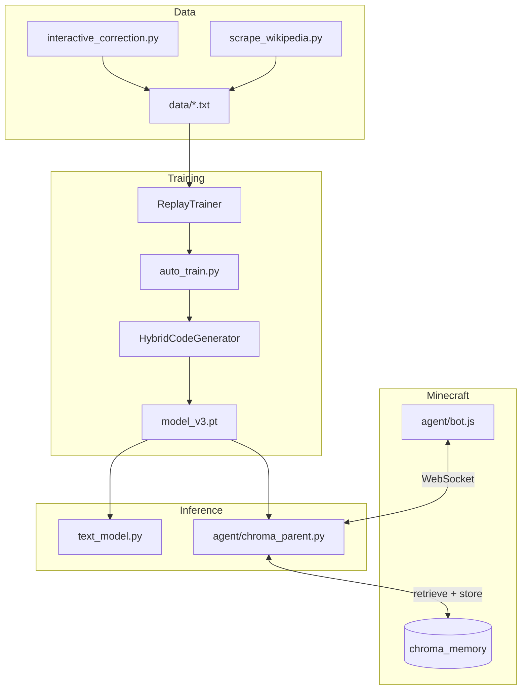

# Virus — System Architecture

Virus is a personal research project: a small character-level language model that learns continuously from text files and optionally embodies as a Minecraft bot.

## Honest assessment

**What works well**

- The hybrid architecture (gated memory + causal attention) is a reasonable design for a char-LM at this scale.
- The `### INPUT:` / `### OUTPUT:` data format is well-suited for conversation; the model just was not trained to prioritize it until now.
- ChromaDB + WebSocket separation keeps the Minecraft client simple.
- Continuous Wikipedia ingestion is a practical way to grow knowledge without manual curation.

**What limits the system**

- **Model size**: 64-dim embeddings and ~96 char vocab cannot hold code, chat, wiki, and Minecraft actions equally. This is the main ceiling — not a bug, but physics.
- **Char-level prediction**: Everything is next-character prediction. Conversation quality depends on the model learning response patterns, not on a dedicated dialogue head.
- **Minecraft control**: Asking a prose/code LM to output a single digit 0–6 is a hack. Chroma retrieval helps context but does not replace a real policy.
- **No pretraining**: Training from scratch on ~40 small files is fundamentally different from fine-tuning a larger pretrained model.

**Design goal**

The intended result is a **personal AI that learns over time** — chat, code snippets, Wikipedia facts, human corrections — with optional physical embodiment in Minecraft. The system delivers that vision at a **prototype** level. Expect coherent short replies in trained domains, rough code flavor, and a bot that moves semi-randomly with memory logging.

## Project layout

```
Virus/
├── model_v3.py              # Neural architecture
├── model_v3.pt              # Trained weights
├── vocab.json               # Global character vocabulary
├── config.py                # Shared hyperparameters
├── dataset.py               # Data loading + mixed/replay sampling
├── auto_train.py            # Main trainer
├── generate_v3.py           # CLI generation
├── text_model.py            # Interactive chat
├── main.py                  # CLI entry point
│
├── agent/                   # Minecraft embodiment
│   ├── chroma_parent.py     # WebSocket parent + ChromaDB + inference
│   ├── bot.js               # mineflayer client
│   └── check.js             # Connection smoke test
│
├── scripts/                 # Legacy / utilities
│   ├── train_v3.py          # Old single-file trainer
│   ├── create_v3.py         # Train + generate wrapper
│   └── extract.py           # Extract defs from all.txt
│
├── data/                    # Training text files
├── chroma_memory/           # ChromaDB persistence
├── server/                  # Bundled Minecraft server
│
├── scrape_wikipedia.py      # Wikipedia fetcher
├── continuous_learner.py    # Local scrape → train → git push
├── auto_learn_ci.py         # CI scrape → train
├── interactive_correction.py
│
├── Chroma.py                # Launcher → agent/chroma_parent.py
├── M_bot.js                 # Launcher → agent/bot.js
└── requirements.txt
```

Root launchers (`Chroma.py`, `M_bot.js`, `train_v3.py`) exist so existing commands keep working.

## Data flow



## Model

`HybridCodeGenerator` (`model_v3.py`):

1. Char embedding → 64-dim → projected to 128-dim
2. Gated memory cell — recurrent state within a sequence
3. Causal self-attention over the current window
4. Learnable fusion (`alpha`) → output logits

| Parameter | Default |
|-----------|---------|
| `embed_size` | 64 |
| `state_size` | 128 |
| `window_size` | 64 |
| `block_size` | 128 |
| `vocab_size` | ~96 chars |

The gated memory cell carries state during generation and within a 128-char training window. It does **not** persist knowledge across training sessions — that lives in `model_v3.pt` weights only.

## Training pipeline

### Default: mixed + replay + balanced + instruction focus

`auto_train.py` uses four anti-forgetting mechanisms:

| Mechanism | What it does |
|-----------|--------------|
| **Mixed batches** | New and old files sampled in the same training session |
| **Replay ratio (35%)** | Batches from previously trained files during incremental runs |
| **Balanced sampling** | Equal weight per file — stops large wiki files from drowning greetings/code |
| **Instruction focus (40%)** | Extra batches from `### OUTPUT:` sections — improves chat quality |
| **Weight anchoring** | L2 penalty toward checkpoint weights — reduces drift |
| **Domain perplexity** | Logged after each run to spot forgetting |

### Hyperparameters (`config.py`)

| Parameter | Default |
|-----------|---------|
| `EPOCHS` | 50 |
| `STEPS_PER_EPOCH` | 100 |
| `BATCH_SIZE` | 32 |
| `LEARNING_RATE` | 5e-4 |
| `REPLAY_RATIO` | 0.35 |
| `INSTRUCTION_SAMPLE_RATIO` | 0.4 |
| `ANCHOR_LAMBDA` | 0.01 |

### Data formats

All `data/*.txt` files are character sequences. Instruction files use:

```
### INPUT:
user message
### OUTPUT:
model response
```

Code files (`python.txt`, etc.) are raw source. Wiki files (`wiki_*.txt`) are article extracts.

### State files

- `auto_train_state.json` — which files have been trained
- `vocab.json` — global char vocabulary for training and inference

## Inference

| Command | Purpose |
|---------|---------|
| `python text_model.py` | Interactive chat |
| `python main.py "hello" 100` | One-shot generation |
| `python generate_v3.py` | Direct script |

All paths use `vocab.json` and `model_v3.pt`.

## Minecraft agent

### Startup

1. Start Minecraft server (`server/`, port 25565)
2. `python Chroma.py`
3. `node M_bot.js` (or `node agent/bot.js`)

### Flow

1. Bot sends `state_update` every ~2s
2. Parent detects state changes (health, movement)
3. ChromaDB retrieves similar past experiences
4. Model generates one character (0–6) for action selection
5. Experiences stored when meaningful changes occur

| Digit | Action |
|-------|--------|
| 0–3 | forward, back, left, right |
| 4 | jump |
| 5 | attack |
| 6 | use |

## Continuous learning

| Script | Use |
|--------|-----|
| `continuous_learner.py` | Local: scrape → train → git push |
| `auto_learn_ci.py` | CI: scrape → train only |
| `.github/workflows/main.yml` | Daily incremental learning |

CI trains **new files only** with replay — not full `--retrain`.

## Commands

```bash
# Train new files (default)
python auto_train.py

# Retrain all domains together
python auto_train.py --retrain

# Gentle update after wiki scrape
python auto_train.py --lr 0.0001 --epochs 30

# Human correction loop
python interactive_correction.py

# Full local learning cycle
python continuous_learner.py
```

## Future improvements (priority order)

1. **Dedicated Minecraft policy** — small classifier or rule layer instead of char-digit guessing
2. **Larger embed size** — 128–256 dim if hardware allows (requires retrain)
3. **LoRA adapters per domain** — code vs chat vs wiki on shared trunk
4. **Pretrained base** — fine-tune a small GPT-2 or similar instead of training from scratch

## What retains knowledge?

| System | Persists? | Used at inference? |
|--------|-----------|-------------------|
| `model_v3.pt` weights | Yes | Yes |
| `vocab.json` | Yes | Yes |
| ChromaDB `chroma_memory/` | Yes | Yes (retrieved for actions) |
| `GatedMemoryCell` state | Within one sequence | Partially |
| `auto_train_state.json` | Yes | Training only |
